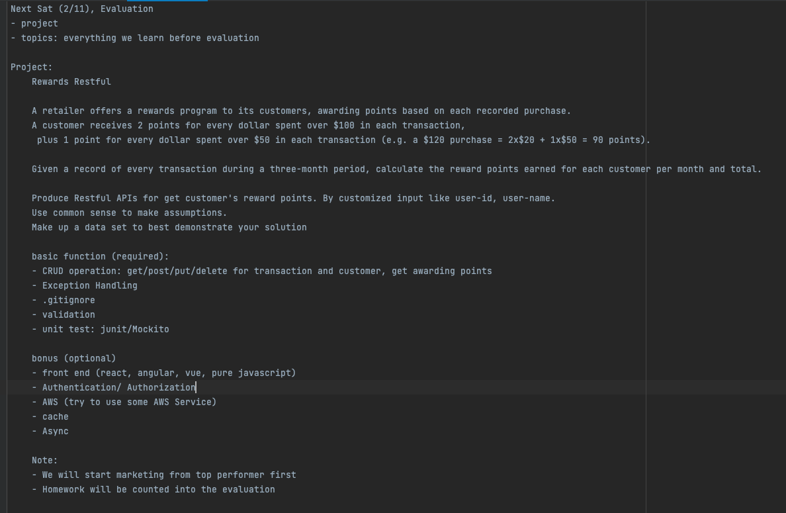
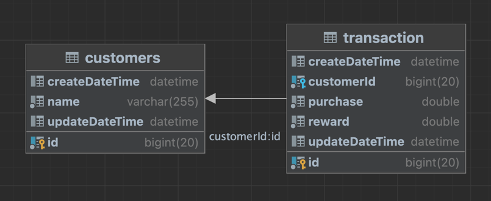

# reward-restful

## Project requirement


## How to run the program

### Prerequisites
* Install appropriate Java JDK (like JDK 1.8)
* Install IntelliJ or any appropriate IDE.
* Clone the repository `git clone https://github.com/stefan0711/reward-restful.git`
* This project uses the maven build tool, and all the dependencies used are in pom.xml
* Use the Postman test Api
* Use mysql as the database
* The database configuration is in `application.properties`
* Please modify the database connection code when using
```properties
spring.datasource.url = jdbc:mysql://localhost:3306/reward?useSSL=false&serverTimezone=UTC
spring.datasource.username= yourUsername
spring.datasource.password= yourPassword
```
### Start the project in the IDE
* Run the `reward-restful/src/main/java/com/moyi/rewardrestful/RewardRestfulApplication.java`

## database schema
